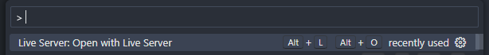

# snake_js
Basic snake game only with js, html and css

## How to play it
You need to serve the files via a (local) server.
You can use the `Live Server` extension in VS Code. For that, install the extension, open the project's folder in VS Code. Finally, open the `index.html` file and using the command palette, choose `Open With Live Server`.

You are ready, you can play !
